# Astro Image Lab — Quick Start Guide

## Overview

Astro Image Lab is a dual-image characterisation tool for astrophotography.
Load two calibrated image stacks of the same sky target (captured through different filters,
different cameras, or different conditions), and the tool produces a side-by-side comparison report covering:

- **PSF / MTF** — star size, shape, and resolution limit
- **Halo analysis** — scattering around bright stars
- **Edge sharpness (LSF)** — contrast at resolved edges
- **Power spectrum** — spatial frequency content and fine-detail ratio
- **Spatial detail** — local std, Laplacian of Gaussian, and wavelet maps
- **Signal / Noise** — sky background, noise factor, and per-star SNR

Output is a self-contained HTML report and an interactive Data Inspector window. Image B is optional — loading only Image A runs the app in single-image analysis mode.

---

## Prerequisites

- Two FITS, XISF, TIFF image stacks (`.fits`, `.fit`, `.fts`, `.xisf`, `.tiff`, `.tif`) of the **same sky target**,
  registered and cropped to a common frame — see [Image Preparation](#image-preparation-before-you-open-the-app) below
- **Highly recommended:** starless versions of each image (generated with StarNet2,
  GraXpert, StarXTerminator, SyQon Starless, or similar)
- If this is comparing two narrowband filters, the bandwidth in nm for each image (from the filter spec sheet — e.g. `3` for a 3 nm Hα filter)
- Filter thickness in mm for each image (from the filter spec sheet — typically 1–3 mm)
- An output folder with write access

---

## Image Preparation (Before You Open the App)

Good input images produce reliable comparisons. Three preparation steps matter significantly.

### Registration (Alignment)

Both images must cover the **same sky field** and be **pixel-aligned** before loading.

> **⚠️ Important:** Astro Image Lab runs an automatic `astroalign` registration at analysis
> time as a safety net, but the best results come from images that are already well-registered
> in your pre-processing software before stacking.

Recommended workflow:
1. Register Image B to Image A using your stacking software — PixInsight StarAlignment,
   Siril's registration module, ASTAP, or similar.
2. Save both final stacks from the same session so they share a common reference frame.

The app will detect and perform *minor* registration adjustments if needed. Poor registration causes PSF, edge, and spatial detail comparisons to measure misalignment
artifacts rather than genuine filter differences.

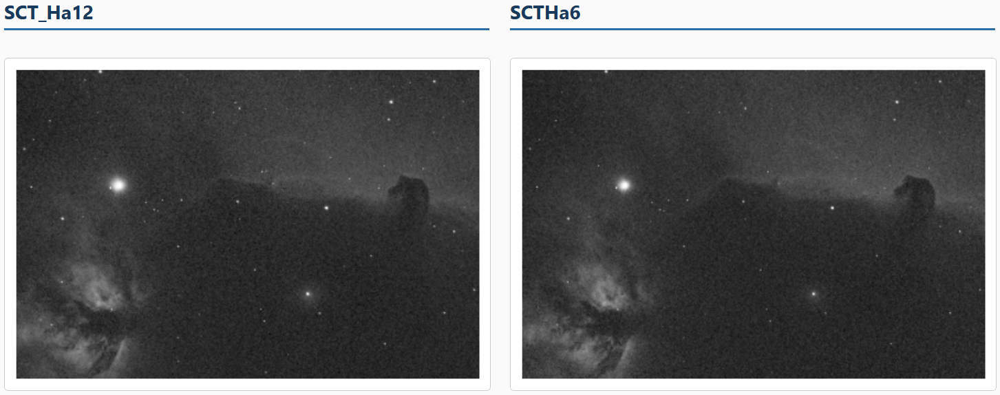
*Example of two registered images covering the same star field — stars overlap precisely.*

### Cropping to a Common Sky Region

Images captured at different times, with dither patterns, or on different sensor sizes may
have different frame boundaries even after alignment. Crop both images to their **shared sky
area** before loading so edge regions containing roll-off vignetting or missing data do not
contaminate background estimation.

- In your stacking software, apply the same crop bounding box to both final stacks.
- The ROI selection tool inside the app can further restrict individual analyses to a
  sub-region, but starting from consistently-cropped images gives cleaner background
  subtraction and more accurate noise estimates.

### Starless Versions (Highly Recommended)

> **💡 Strongly recommended** for Power Spectrum and Spatial Detail analysis.

Stars are compact, high-frequency point sources. They dominate the high-frequency end of
the power spectrum and inflate local-σ and LoG map values near star cores — making it hard
to compare filter performance on the nebula itself. Starless images remove this
contamination.

**How to generate a starless image:**
- Run **StarNet2**, **GraXpert** (star removal mode), or **StarXTerminator**, or SyQon Starless on each of your final registered stacks.
  on the final registered, calibrated stack.
- Save with a `_starless` suffix in the same folder as the main stack
  (e.g. `image_starless.fits`). The app detects this naming pattern automatically on load.

**What starless images are used for in the report:**
| Analysis | Starless benefit |
|----------|-----------------|
| Power Spectrum | Primary input — stars heavily bias high-frequency content |
| Spatial Detail (std / LoG / wavelet) | Primary input — star cores inflate local sharpness maps |
| SNR Section | Side-by-side histogram comparison (dashed overlay) |
| Edge Analysis | Optional — uses starless if loaded, otherwise main image |

After each main image loads, the app automatically searches the same folder for a file
named `<stem>_starless.<ext>`. If found, it loads silently and a confirmation appears.
If not found, a dialog prompts you to locate one manually.

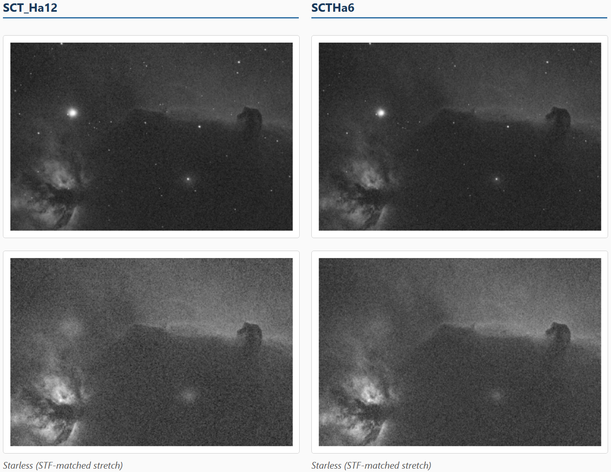
*A narrowband image alongside its starless counterpart.*

---

## Getting the Application

### Option A — Download a pre-built binary (no Python required)

Pre-built binaries for Windows, macOS, and Linux are produced automatically by GitHub
Actions on every push to `main`. Download the latest artifact from the
[Actions tab](../../actions) → most recent **CI** run → **Artifacts** section.

| Platform | File | How to run |
| -------- | ---- | ---------- |
| **Windows** | `AstroImageLab-win64.zip` | Unzip and double-click `AstroImageLab.exe` |
| **macOS** | `AstroImageLab-macos.zip` | Unzip, then see the Gatekeeper note below |
| **Linux** | `AstroImageLab-linux.zip` | Unzip and run `./AstroImageLab` from a terminal |

**macOS — Gatekeeper:** the binary is not code-signed, so macOS will block it on first
launch. Use either method to open it once:

- Right-click the binary → **Open** → click **Open** in the security dialog, **or**
- In Terminal: `xattr -dr com.apple.quarantine AstroImageLab`

### Option B — Run from source (Python / conda)

```bash
git clone https://github.com/<your-username>/AstroImageLab.git
cd AstroImageLab
conda env create -f environment.yml
conda activate astrolab
python AstroImageLab.py
```

---

## Step-by-Step Workflow

### Step 1 — Launch the Application

Run `python AstroImageLab.py` (or the packaged executable) from the project directory.
The main window opens with two empty image panels side by side and the control panel below.

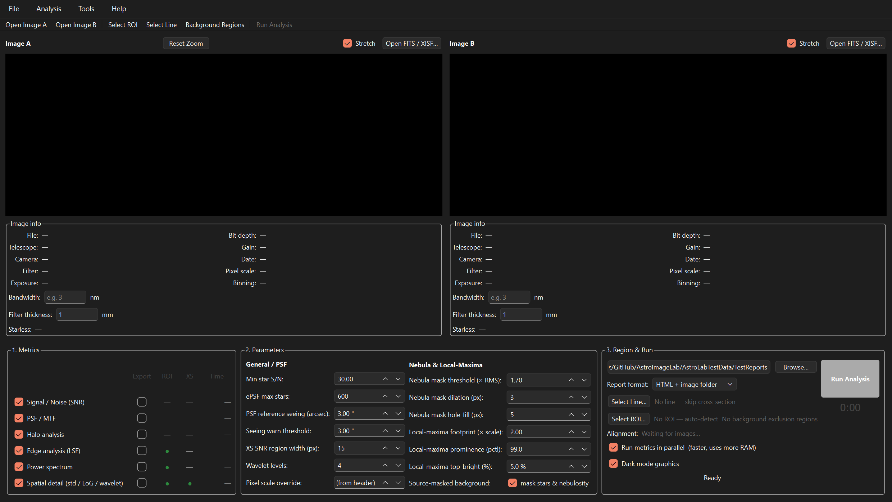
*Application at startup. Image A is on the left, Image B on the right.* Pink arrows show where to load each image. 

---

### Step 2 — Load Image A

1. Click **"Open FITS / XISF…"** in the Image A panel header (top-left of the panel),
   or use the menu **File → Open Image A…**
2. In the file dialog, select your first image file. Accepted formats: `.fits`, `.fit`,
   `.fts`, `.xisf`
3. The image loads and displays with an auto-stretch applied.

#### Starless version (automatic detection)

Immediately after loading, the app searches the same folder for a companion file named
`<stem>_starless.<ext>` (e.g. `NGC6992_Ha_starless.fits` alongside `NGC6992_Ha.fits`).

- **Found automatically** → the starless image loads silently and a brief confirmation
  dialog appears. The starless filename turns green in the panel header.
- **Not found** → a dialog asks *"Do you have a starless version of this image?"*
  Click **Yes** to browse for one manually, or **No** to skip starless for this image
  (Power Spectrum and Spatial Detail will still run using the main image, but star
  contamination will be present).

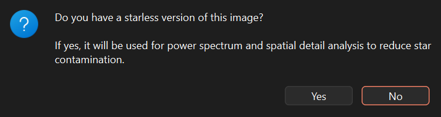
*The manual prompt appears only when no _starless companion file is found automatically.*

After loading (with or without a starless version), Image A is displayed. The panel header
shows the filename and starless status (cyan arrows).

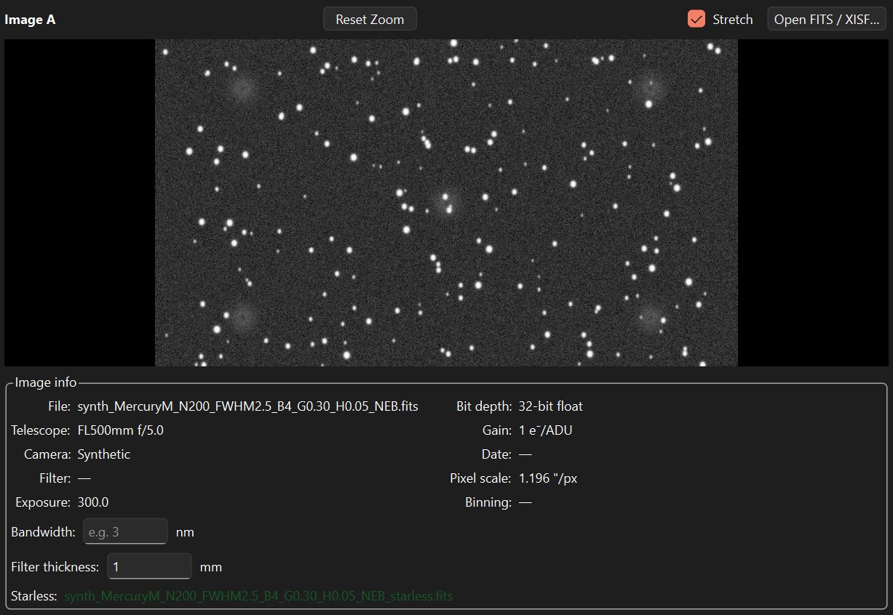
*Image A loaded. Bandwidth and filter thickness fields are visible in the panel header (magenta arrow).*

---

### Step 3 — Load Image B *(optional)*

Repeat Step 2 for the Image B panel (right side). Use the menu **File → Open Image B…**
or the **"Open FITS / XISF…"** button in the Image B panel header.

> Load images in order — Image A first, then Image B — so the starless prompts are
> presented one at a time.

**Image B is optional.** If you only load Image A, clicking **Run Analysis** shows a
confirmation dialog and then runs in **single-image analysis mode**: PSF, SNR, halo,
edge, power spectrum, and spatial detail all still run on Image A alone, but comparison
tables and A/B differential metrics are unavailable.

---

### Step 4 — Enter Filter Metadata

Each image panel header contains two small input fields:

**Bandwidth (nm)**
- Enter the filter passband full-width at half-maximum in nm (e.g. `3` for a 3 nm Hα filter, `6` for a 6 nm filter). It is ok to leave this blank if this is not a narrowband filter.
- Required for: Edge Contrast Ratio calculation and Power Spectrum frequency scaling.
- If left blank, a warning appears when you click Run — you can proceed, but those results will lack bandwidth-relative context.

**Filter thickness (mm)**
- Enter the glass substrate thickness (e.g. `1` for a 1 mm filter).
- Used for: the expected-halo-radius estimate shown in the Halo Analysis section, computed from filter thickness, focal ratio, and pixel size.
- Default is `1` mm if not changed.

---

### Step 5 — Draw the Cross-Section Line

The cross-section line defines a 1-D brightness profile sampled across both images.
It is used by Spatial Detail cross-section plots and the Cross-Section SNR analysis.

1. Click **"Select Line…"** in the control panel. The button label changes to
   "Cancel Line" and the cursor becomes a crosshair on both image panels.
2. **Click once** on the image to set the **start point**.
3. Move the mouse — a live preview line follows the cursor.
4. **Click a second time** to set the **end point**. The line locks and is drawn on
   both panels simultaneously.

> **💡 Best practice:** Draw the line through a representative bright nebula feature
> (peak signal) and across an adjacent region of dark sky (background). This gives the
> Cross-Section SNR meaningful bright and dark regions to measure.

If the line extends outside the ROI (if one is set), a warning will appear — consider
redrawing the line entirely within the ROI, or clear the ROI.

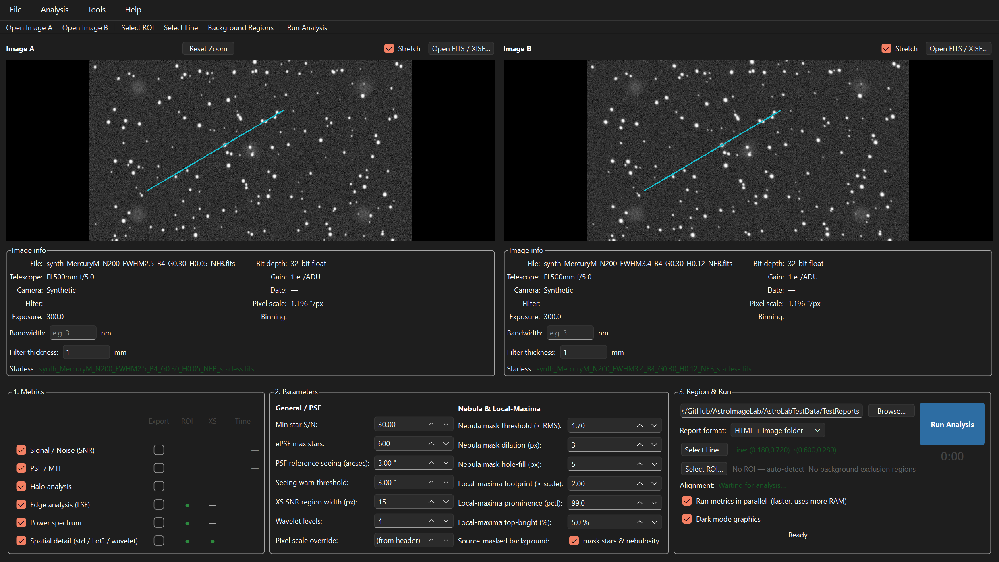
*Click once to start the line, move, then click again to lock it. The locked cross-section line appears on both image panels simultaneously.*


---

### Step 6 — Draw the Region of Interest (ROI)

The ROI restricts certain analyses to a rectangular sub-region of the image — useful for
focusing on the nebula core and excluding frame edges, vignetting, or noisy corners.

1. Click **"Select ROI…"** in the control panel. The button label changes to "Cancel ROI"
   and the cursor becomes a crosshair.
2. **Click and drag** a rectangle over the region you want to analyse.
3. **Release the mouse** to lock the ROI. It appears as a blue-cyan rectangle on both panels.

Metrics that use the ROI (shown by **●** in the Metrics grid): Edge Analysis,
Power Spectrum, Spatial Detail.

> **Toolbar shortcut:** the **Select ROI…** and **Select Line…** actions in the toolbar
> above the image panels do the same thing as the matching control-panel buttons — use
> whichever is more convenient.

> **💡 Tip:** The ROI does not need to cover the entire image. A tight ROI around the
> nebula of interest produces cleaner local statistics than analysing the full frame
> including dark sky borders.

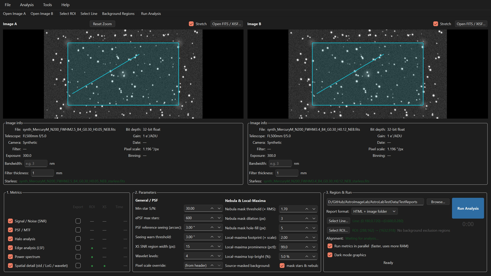
*Click and drag to draw the ROI rectangle. The locked ROI appears as a blue-cyan overlay on both panels.*


---

### Step 7 — Configure Parameters

The **Parameters** group (lower-left of the control panel) controls the numerical settings
for each analysis engine. See the [Parameter Reference](#parameter-reference) table for
full descriptions. For most comparisons the defaults are appropriate.

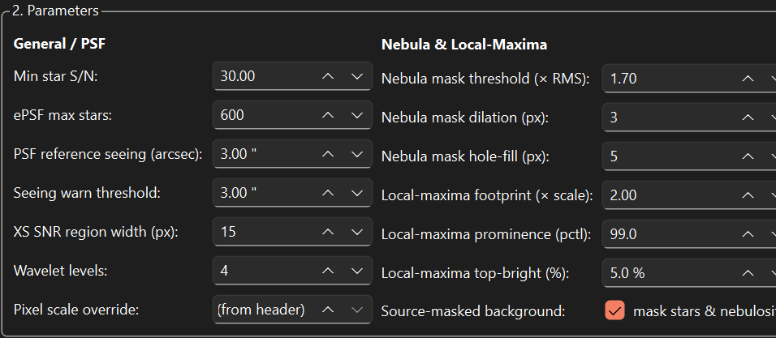
*The Parameters group. Hover any label for a tooltip description.*

---

### Step 8 — Select Metrics and Output Options

**Metrics grid**

All six metrics are selected by default. Uncheck any metrics you do not need to reduce
run time. Each row also has:

- **Export** checkbox — saves the metric's figures as standalone PNG files to the output folder
- **ROI** indicator (●) — shows which metrics respect the drawn ROI
- **XS** indicator (●) — shows which metrics use the cross-section line
- **Time** column — shows elapsed computation time per metric during the run

**Output settings**

- **Output directory** — click Browse and select a folder. The self-contained HTML
  report and any exported PNGs are written here.
- **Run metrics in parallel** — when checked, all selected metrics compute simultaneously
  in separate threads. Significantly faster on multi-core CPUs; uses more RAM because
  all analyses hold their working data at once. Unchecked by default.
- **Dark mode graphics** — when checked (default), report figures use a dark
  matplotlib theme instead of a white background.

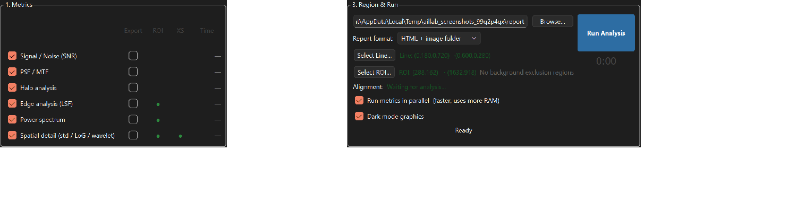
*Metrics grid with Export / ROI / XS / Time columns, plus output directory and format.*

---

### Step 9 — Run the Analysis

Click **Run Analysis**. The button disables and the following happens:

1. Images are aligned (astroalign registration)
2. Each selected metric starts computing — its timer counts up in the Time column
3. The progress bar advances as metrics complete
4. On completion, a dialog shows the report file path and any warnings

> **Warnings that may appear before the run starts:**
> - *"No filter bandwidth set"* — you can proceed; Edge and Power Spectrum results will
>   lack bandwidth-relative context.
> - *"No cross-section line selected"* — you can proceed; Spatial Detail will show maps
>   only (no profile overlays), and Edge Analysis will auto-detect the strongest gradient.

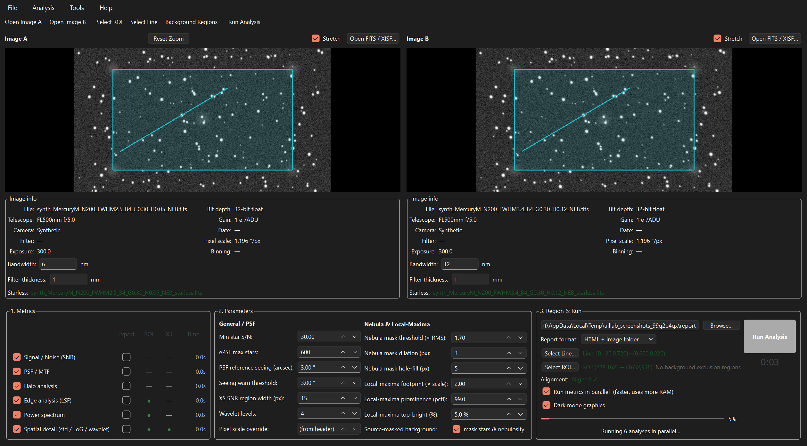
*Each metric's timer counts up in blue while computing, turns green when complete.*

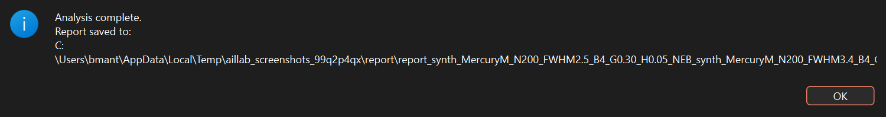
*Completion dialog showing the saved report path and any warnings.*

---

### Step 10 — View the Report and Inspector

After a successful run:

- **HTML report** opens automatically in your default web browser.
- **Data Inspector** opens as a separate window for interactive exploration of every
  array the report was built from.

The Data Inspector is built around three linked, pan/zoom-synchronised panels —
**Image A** | **Image B** | **Comparison** — with a cross-section chart and a
comparison histogram below them, and two correlation plots at the bottom.
**Section**/**Image set**/**A**/**B** dropdowns pick what feeds the panels, from the raw
input images through every Section 8 spatial-detail sub-map (LoG, wavelet, gradient,
local σ, local entropy, at every scale); a **Compare** dropdown sets the Comparison
panel to either a log ratio (`log₁₀(|A|/|B|)`, the default) or a plain difference
(`A − B`). A **View** dropdown switches between side-by-side and an A/B swipe divider,
and a **Tool** dropdown chooses what a click-drag on the images does: pan/zoom, move
the cross-section line, or resize the ROI. Drag the cross-section line onto any
feature; the chart below updates live with a hover crosshair and tooltip.

The region controls let you restrict the histogram and correlation plots to a
**Region** (rectangle, ellipse, or freehand lasso) and/or a brightness **Threshold**
(percentile or absolute, upper or lower tail) — the two correlation plots then show
the split, inside the region/threshold vs. outside it. Lasso-select points on a
correlation plot to highlight the matching pixels back on the image panels.

You can reopen the Data Inspector at any time via **File → Open Data Inspector…** and
selecting either the `.html` report or the `_inspector.npz` data file. The original
**Report Inspector** — a simpler matplotlib-based side-by-side/slider viewer over the
same data — remains available via **File → Open Report Inspector…**, but no longer
opens automatically.

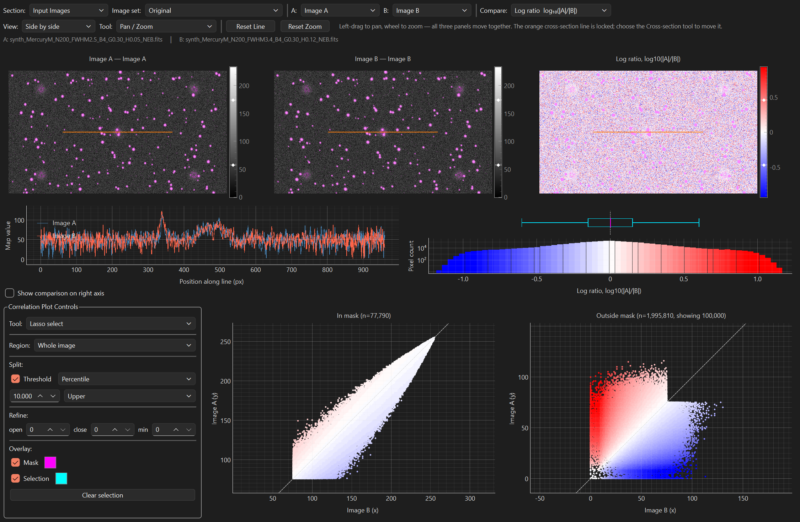
*The Data Inspector with synchronized Image A / Image B / Comparison panels, cross-section, and correlation plots.*

---

## Parameter Reference

| Parameter | Default | Range | Description |
|-----------|---------|-------|-------------|
| Min star S/N | 30 | 5 – 500 | SNR threshold for star inclusion in ePSF fitting. Raise to use only bright, unambiguous stars in sparse fields; lower cautiously if too few stars are detected. |
| ePSF max stars | 600 | 10 – 2000 | Maximum candidate stars passed to the ePSF builder. Stars are ranked by peak flux; the brightest N are used. Reduce to 200–300 on crowded fields to cut computation time dramatically. |
| PSF reference seeing (arcsec) | 3.00″ | 0.5 – 10.0″ | FWHM of the benchmark Moffat PSF plotted in PSF/MTF report figures. Set to the typical seeing for your site and session conditions. |
| Seeing warn threshold | 3.00″ | 0.5 – 10.0″ | If the measured median star FWHM exceeds this value, the report flags a poor-seeing warning for that image. |
| XS SNR region width (px) | 15 | 3 – 100 | Width in pixels of the bright and dark sample windows used in the Cross-Section SNR calculation. Wider windows average over more pixels (more stable); narrower windows are more spatially selective. |
| Wavelet levels | 4 | 2 – 6 | Number of wavelet decomposition levels in Spatial Detail analysis. Level 1 ≈ 2 px finest detail; level 4 ≈ 16 px structure; level 6 ≈ 64 px. |
| Nebula mask threshold (× RMS) | 1.70 | 0.5 – 5.0 | Nebula mask threshold for Section 8 spatial detail analysis. Pixels above this many RMS units over background are classified as Nebula. |
| Nebula mask dilation (px) | 3 | 0 – 20 | Grows the Section 8 nebula mask outward by this many pixels to capture dim/dark transition regions at nebula edges. |
| Nebula mask hole-fill (px) | 5 | 0 – 20 | Fills enclosed background gaps up to this size (px per side) inside the Section 8 nebula mask, before dilation. |
| Local-maxima footprint (× scale) | 2.00 | 1.0 – 6.0 | Section 8j local-maxima mask: neighbourhood size, as a multiple of each metric's own spatial scale, used to test whether a pixel is a local maximum. |
| Local-maxima prominence (pctl) | 99.0 | 50.0 – 99.9 | Section 8j local-maxima mask: minimum peak height, as a percentile of each scale's own combined \|A\|,\|B\| peak-source values. |
| Local-maxima top-bright (%) | 5.0 | 0.5 – 25.0 | Section 8j local-maxima mask: pixels in the top N% of Image A's or Image B's own value distribution are unioned (OR) into the mask, so broad bright plateaus are captured even when they never register as an isolated local-maximum peak. |
| Source-masked background | on | on / off | Detects stars and extended nebulosity and excludes them before estimating the sky background, then fits a low-order surface to the mesh cells that survive. The plain per-cell estimate assumes every 64×64 cell is mostly sky; over nebulosity it settles on the nebula level instead, which under-states every SNR figure in the report. Costs roughly 18 s per 24 MP image. Turn it off to reproduce reports generated before this option existed — report section 3g shows the full audit trail and what the masking changed either way. |
| Pixel scale override | 0.0 (from header) | 0.0 – 20.0 ″/px | Forces a specific plate scale instead of reading from the FITS/XISF WCS header. Set this when your header is missing or incorrect. Leave at 0.0 to use the header value automatically. |

---

## Metrics Reference

| Metric | ROI | XS Line | What it measures |
|--------|:---:|:-------:|-----------------|
| **Signal / Noise (SNR)** | — | — | Global sky-subtracted SNR, per-star SNR (from DAOStarFinder catalog), sky background level (μ_sky), sky noise (σ_sky), noise factor (σ/√μ — indicates Poisson vs read-noise regime), and sky background in electrons when FITS gain header is present. |
| **PSF / MTF** | — | — | ePSF model image, FWHM, ellipticity, Strehl ratio, Moffat β, MTF curve, and MTF50 — the spatial frequency at which modulation falls to 50%. |
| **Halo analysis** | — | — | Measures the extended scattering halo around bright stars: halo radius, brightness profile, and integrated halo flux compared to star core flux. Broad halos indicate internal reflection or coating scatter in the filter. |
| **Edge analysis (LSF)** | ● | — | Locates high-contrast edges in the image (or the user-drawn cross-section), fits an Edge Spread Function and Line Spread Function, and derives MTF50 and Edge Contrast Ratio. Restricted to the ROI when one is set. Uses the starless image when available. |
| **Power spectrum** | ● | — | Radial azimuthally-averaged power spectral density from 0 to the Nyquist frequency. Reports the mid/high-frequency ratio as a single measure of fine-detail preservation. Restricted to the ROI when set; uses the starless image when available. |
| **Spatial detail** | ● | ● | Five complementary spatial analysis families — local standard deviation (texture), Laplacian of Gaussian (edge/feature response), wavelet decomposition, gradient magnitude (edge sharpness), and local entropy (texture complexity) — each compared via a log-ratio map and correlation scatter, plus a noise-corrected cross-method overview and scale-adaptive local-maxima masked metrics. Also produces cross-section profiles along the drawn line and a Cross-Section SNR estimate with bright/dark sample windows. |

**Legend:** ● = metric uses this input when provided; — = not applicable.

---

## Additional Tools

Three standalone utilities live in the **Tools** menu. They are independent of the
Steps 1–10 workflow above — use them before generating input data, or on the side for
per-star inspection.

### Synthetic Data Generator

**Tools → Synthetic Star Data…**

Generates a fully synthetic FITS star field for testing the app without real data.
Choose from a 24-camera database (ZWO, QHY, Player One), configure a Moffat PSF and
field-position-dependent optical aberrations (coma, field curvature, astigmatism,
spherical, collimation, defocus, backfocus, guiding error, halo), and optionally add a
simulated nebula and sky background at a chosen Bortle class. A live STF-stretched
preview updates as you adjust sliders. Click **Generate** to write a FITS file — a
matching `_starless` companion is always written alongside it — and optionally load the
result directly into Image A or Image B.

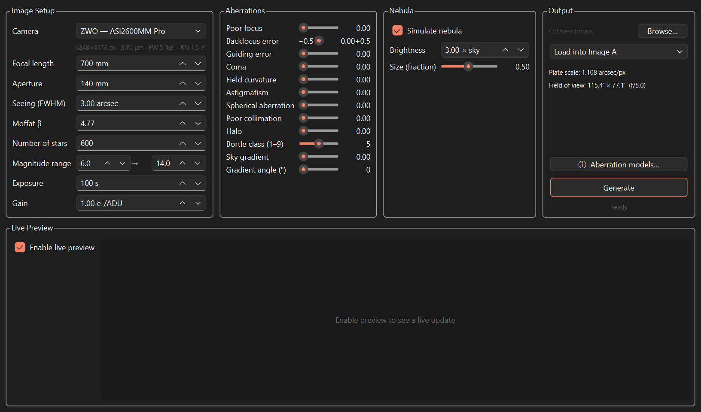
*The Synthetic Data Generator, configured for a ZWO ASI2600MM Pro field with a simulated nebula.*

### Spatial Target Generator

**Tools → Synthetic Spatial Detail Target…**

Generates a calibrated 4-column × 3-row grid of test patterns at known spatial
frequencies — sine and square-wave gratings at frequencies aligned to the wavelet
decomposition levels, a Siemens star, and a slant edge — with a contrast ramp from top
to bottom. Always produces a clean/degraded FITS pair. Load the clean version into
Image A and the degraded version into Image B to calibrate the Spatial Detail metrics
against a known ground truth, rather than real (and therefore unknown) filter
differences.

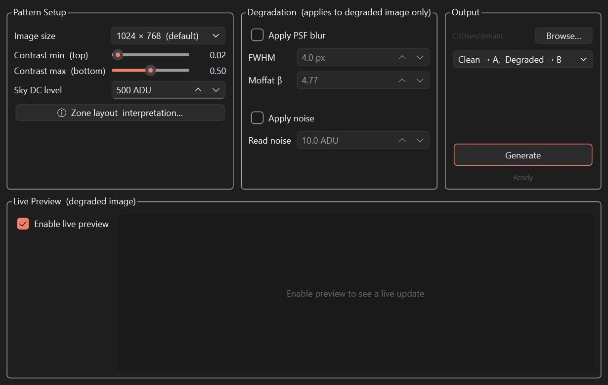
*The Spatial Target Generator dialog.*

### Halo Analyzer

**Tools → Halo Analyzer…**

An interactive, click-a-star inspector for PSF and halo shape, independent of the main
report's Halo Analysis section. Requires Image A to already be loaded (Image B is
optional). Click any detected star to see a Moffat fit, shape metrics (eccentricity,
ellipticity, orientation), a cross-section profile, and a radial distribution function
(RDF) plot — all recomputed live as you click different stars or adjust the sample
radius. Saturated stars are flagged "Sat." in the results table.

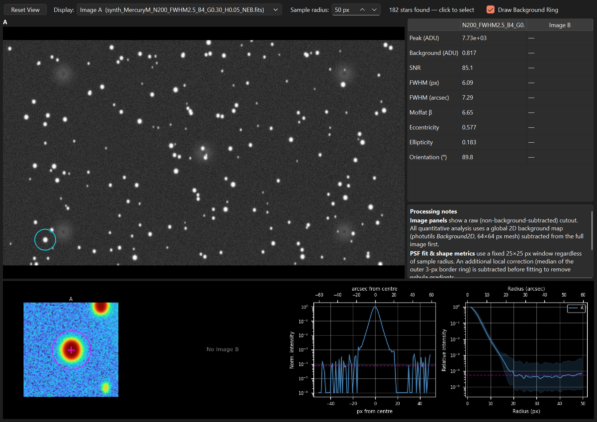
*The Halo Analyzer, showing the Moffat-fit cutout, cross-section, and RDF for a selected star.*

---

## Tips and Troubleshooting

**Zoom and pan**
Scroll the mouse wheel to zoom both image panels simultaneously (centred on the cursor).
Right-click and drag to pan. Click **Reset Zoom** in the Image A panel header to return
both panels to the fit-to-window view.

**Color (RGB) images**
Color images are automatically converted to luminance (green channel or luma weighting)
for all analyses. A note appears in the starless load dialog when this conversion occurs.

**Slow ePSF computation**
ePSF fitting scales with the number of stars. If a run takes more than a few minutes,
reduce **ePSF max stars** to 200–300 in the Parameters group. Alternatively, deselect
PSF / MTF if you only need spatial or SNR metrics.

**No bandwidth entered**
Edge contrast ratio and power spectrum frequency-axis scaling are bandwidth-sensitive.
If you forget to enter a bandwidth value, the analysis still runs but those specific
outputs will be missing relative bandwidth context. A warning dialog appears before the
run so you can cancel and fill in the values.

**Cross-section line outside the ROI**
If the drawn line extends beyond the ROI boundary, a warning dialog explains that
Section 8 (Spatial Detail) profiles will clip the line to the ROI for derived-map
sampling. To avoid clipping, either redraw the line entirely within the ROI, or clear
the ROI (click Select ROI → Cancel ROI before the warning appears).

**Inspector file not found**
Both the Data Inspector and the Report Inspector read a `_inspector.npz` data file saved
alongside the HTML report. If you move or rename the HTML report, move the `.npz` file
with it. If the file is missing, re-run the analysis to regenerate it.
